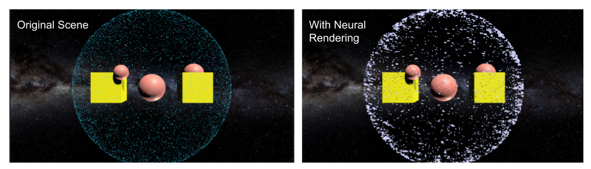
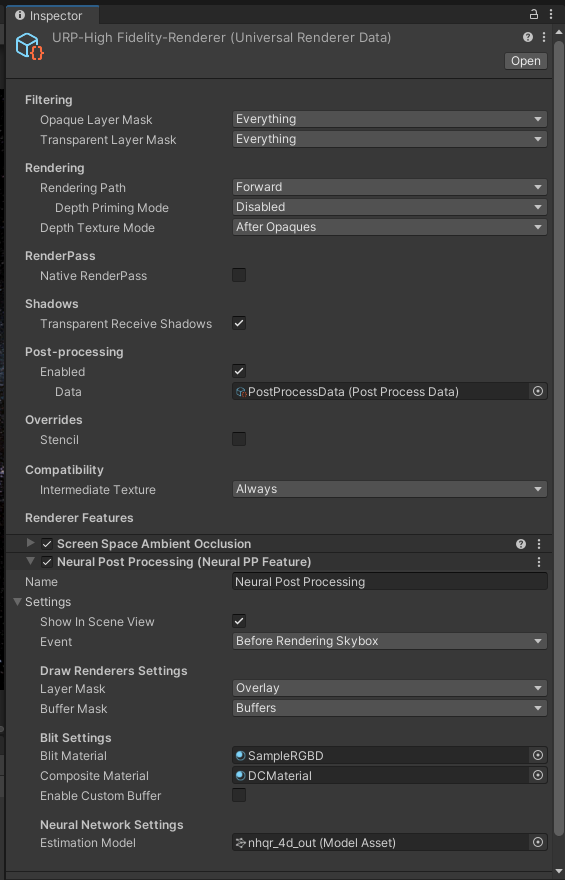

Neural Rendering in Unity
==========================



This Unity sample project demonstrates the following 2 features:
- Modifying Unity's Universal Rendering Pipeline (URP) for creating custom passes for neural rendering
- Implementing and running neural network (NN) inference using Sentis
- Applying neural rendering based post-processing effects using Unity's Visual Effect Graph (VFX Graph)

The neural rendering framework used here is based on [NARVis](https://arxiv.org/abs/2407.19097) and more documentation could be found in the Neural Rendering for VALIXR [report](#).


## Package Requirements
These packages are required to run the project (run with Unity 2022.3.12f1):
- Universal Rendering Pipeline (URP) 14.0.9
- Sentis 2.1.0
- VFX Graph 14.0.9

These packages could be installed via Unity's Package Manager.


## Installation

1. Clone this repository using the following git command:
```bash
git clone https://github.com/VALIXR-Neural-Rendering/nn-unity.git
```

2. Open the project using Unity Hub

3. Select the URP Renderer Asset at `Settings -> URP-HighFidelity-Renderer` and select the `Neural PP Feature` called Neural Post Processing to enable the neural rendering post-processing effects.



4. Enter the game mode and enjoy! In the game mode, control the scene with mouse and Up/Down/Left/Right keys.


## Citation

if you found this project useful, please consider citing our work:
```
@article{hegde2024narvis,
  title={NARVis: Neural Accelerated Rendering for Real-Time Scientific Point Cloud Visualization},
  author={Hegde, Srinidhi and Kullman, Kaur and Grubb, Thomas and Lait, Leslie and Guimond, Stephen and Zwicker, Matthias},
  journal={arXiv preprint arXiv:2407.19097},
  year={2024}
}
```
